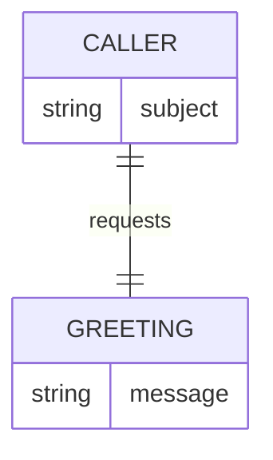

# Domain Model

This service has no persisted state: the greeting it returns is fixed, and
the only identity involved is the signed-in caller making the request.

- **Caller** — the signed-in identity behind the request, taken from the
Thunder-issued token; nothing about it is stored.
- **Greeting** — the single fixed response message; not configurable or
persisted.

