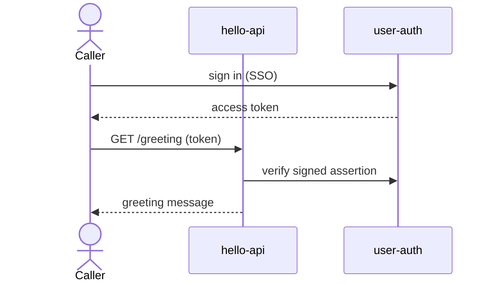

# Greeting request

The Caller signs in via Thunder SSO, then calls the hello-world endpoint and
receives the greeting.

```mermaid
sequenceDiagram
    actor Caller
    participant hello-api
    participant user-auth

    Caller->>user-auth: sign in (SSO)
    user-auth-->>Caller: access token
    Caller->>hello-api: GET /greeting (token)
    hello-api->>user-auth: verify signed assertion
    hello-api-->>Caller: greeting message
```

